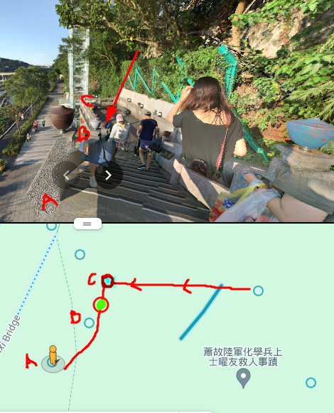

## Description

Where is this? Flag format: Use three decimal points of precision and round. The last digit of the first coordinate is ODD, and the last digit of the second coordinate is EVEN. Example: LITCTF{80.439,-23.498} (no spaces)


## Solution

On uploading the image to Google Image Search, i quickly found out that the name of the bridge is `Daxi Bridge` in Taiwan

After exploring the Bridge Area for bit i found out the place where the picture might have been taken from but not the exact location or coordinate that is needed for the flag



From the above image we can graph out the location

Position A is  `24.8847114,121.2845086`\
Position B is  `24.885723,121.287014`\
Position C is  `24.8847723,121.2847028`

Note : Position C is not properly placed in the map and there is also some problem with actual position of B. I have marked a green spot between Position B and C , also marked by an arrow in the image. 

It seems it's where the photo was taken from. Adjusting and trying different values we finally came up with the following `24.885,121.284`, which is our flag

```
Flag : LITCTF{24.885,121.284}
```
